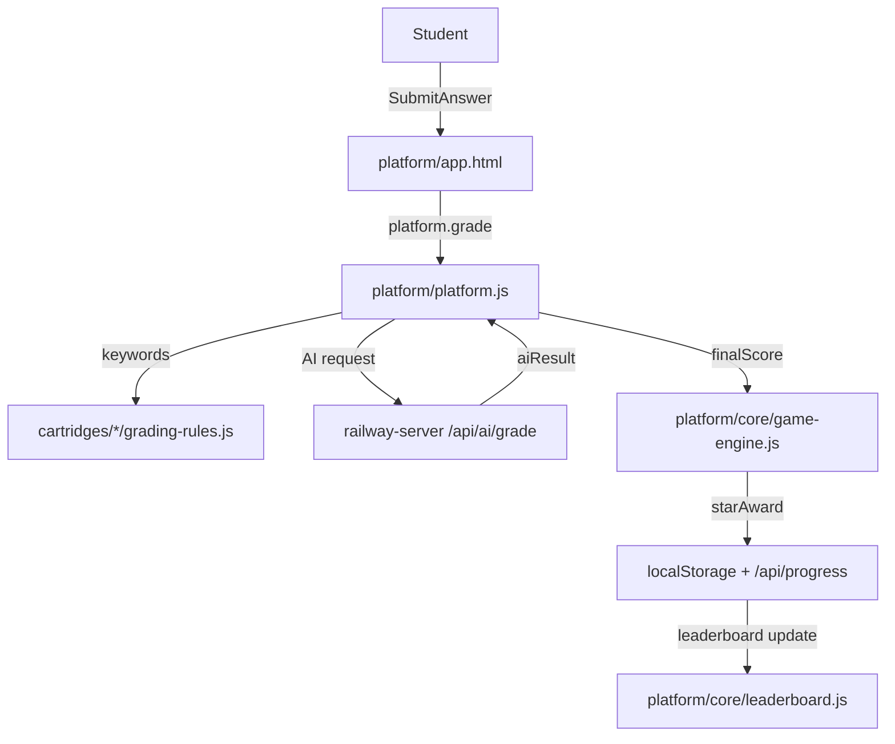
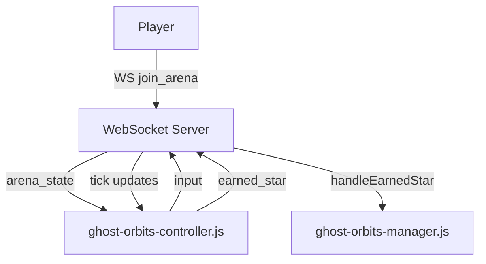

# App State Machine Map

This document maps the state-machine definitions to concrete runtime components and shows the primary connections between them. It uses the state-machine docs as a table of contents and cross-references the current repo layout.

## Sources
- `docs/STATE_MACHINES.md`
- `docs/STATE_MACHINE_CONNECTIONS.md`
- `docs/APP_COMPONENT_MAP.md`
- `cartridges/CARTRIDGE-STATE-MACHINE.md`
- `CLAUDE.md`

## Active Component Map (State Machine → Implementation)

### Core Learning Loop
- **Cartridge loading** (Cartridge SM §1)
  - `platform/platform.js` (load orchestration)
  - `platform/core/cartridge-loader.js` (manifest + module + prompt loading)
  - `cartridges/registry.json` (cartridge registry)
- **Problem generation** (Cartridge SM §2)
  - `platform/platform.js` (shuffle bag draw)
  - `platform/core/shuffle-bag.js` (no-repeat logic)
  - `cartridges/*/generator.js` (generateProblem)
- **Input rendering** (Cartridge SM §7, State Machines §7)
  - `platform/core/input-renderer.js`
- **Grading pipeline** (Cartridge SM §3, State Machines §§2, 22, 31)
  - `platform/platform.js` (keywords + AI merge)
  - `platform/core/grading-engine.js` (generic grading utilities)
  - `railway-server/server.js` (`/api/ai/grade`, `/api/ai/appeal`)
  - `railway-server/prompt-utils.js` (template interpolation)
- **Star award and progression** (State Machines §§1, 26, 101–107)
  - `platform/core/game-engine.js`
  - `shared/scoring.config.js`
  - `platform/app.html` (renderModeTabs, unlock UX)
- **AI feedback panel** (State Machines §46, Cartridge SM §8)
  - `platform/core/ai-feedback-panel.js`
  - `platform/app.html` (onGradingComplete integration)

### Progress Sync and Leaderboards
- **Local persistence** (State Machines §§1, 26)
  - `platform/core/game-engine.js` (localStorage)
- **Server sync** (State Machines §11)
  - `railway-server/server.js` (`/api/progress`, `/api/progress/cartridge-sync`)
  - `platform/app.html` (syncCartridgeProgress)
- **Leaderboard** (State Machines §11)
  - `platform/core/leaderboard.js`
  - `railway-server/server.js` (`/api/leaderboard`, `/api/leaderboard/unified`)

### Teacher and Roster
- **Teacher review** (State Machines §46, teacher review endpoints)
  - `platform/app.html`
  - `railway-server/server.js` (`/api/teacher-review*`)
- **Roster modal** (State Machines §109)
  - `platform/core/roster-modal.js`
  - `railway-server/server.js` (`/api/roster`, `/api/roster/bulk-assign`)
- **Progression overrides** (State Machines §§101–105)
  - `platform/core/game-engine.js` (override merge)
  - `platform/app.html` (UI controls, ws handling)
  - `railway-server/server.js` (`/api/progression-overrides*`)

### Deep Linking
- **URL parameters** (State Machines §112)
  - `platform/app.html` (`?cartridge`, `?level`, `?start`)

### Ghost System
- **Ghost core and network** (State Machines §§128–134)
  - `platform/core/ghost-engine.js`
  - `platform/core/ghost-network.js`
  - `platform/core/ghost-maze-generator.js`
  - `platform/core/ghost-maze-renderer.js`
  - `platform/core/ghost-battle-engine.js`
  - `platform/core/ghost-battle-viz.js`
  - `railway-server/server.js` (`/api/ghost/*`)

### Ghost Orbits
- **Client core** (State Machines §§135–142)
  - `platform/game/ghost-orbits-controller.js`
  - `platform/game/ghost-orbits-panel.js`
  - `platform/game/ghost-orbits-shadow-ai.js`
  - `platform/core/ghost-orbits-*.js`
- **Server arena** (State Machines §§135–142)
  - `railway-server/ghost-orbits-manager.js`
  - `railway-server/server.js` (`/api/ghost-orbits/*`)

### WebSocket / Realtime
- **Client** (State Machines §23)
  - `platform/core/websocket-client.js`
  - `platform/app.html` (handlers for overrides + ghost battle)
- **Server** (State Machines §12)
  - `railway-server/server.js` (ws server + broadcast)

## Primary Connections (Active Flows)

### Learning Loop


### Progression Overrides
```mermaid
flowchart TD
  teacherUI[Teacher UI] -->|PUT override| overridesAPI[/api/progression-overrides]
  overridesAPI -->|broadcast override| wsServer[WebSocket Server]
  wsServer -->|progression_override_changed| wsClient[WebSocket Client]
  wsClient -->|updateOverride| gameEngine
  gameEngine -->|renderModeTabs| app
```

### Ghost System
```mermaid
flowchart TD
  student[Student] -->|SolveProblems| ghostEngine[ghost-engine.js]
  ghostEngine -->|train| ghostNetwork[ghost-network.js]
  ghostEngine -->|sync| ghostAPI[/api/ghost/:cartridgeId/sync]
  ghostAPI -->|leaderboard| ghostLandscape[/api/ghost/:cartridgeId/leaderboard]
  ghostEngine -->|battle| ghostBattleAPI[/api/ghost/:cartridgeId/battle/challenge]
  ghostBattleAPI -->|result| ghostBattleViz[ghost-battle-viz.js]
```

### Ghost Orbits


## Mismatches and Historical Sections

### Documented but Missing (Debug Targets)
- **CTF / KotH / Tiebreakers** are defined in `docs/STATE_MACHINES.md` and referenced in `docs/APP_COMPONENT_MAP.md`, but the expected client modules are not present (e.g., `platform/game/ctf-*`, `koth-*`). Server schemas exist in `railway-server/migrations/009_ctf.sql`, `011_ctf_sessions.sql`, `012_game_modes.sql` while active endpoints are not present in `railway-server/server.js`.

### Historical (Reference Only)
- **Grid Wars / Pong Duel** (State Machines §§3–100 and 33–108) are preserved for reference but not active in current code (v4.0 removal note).
