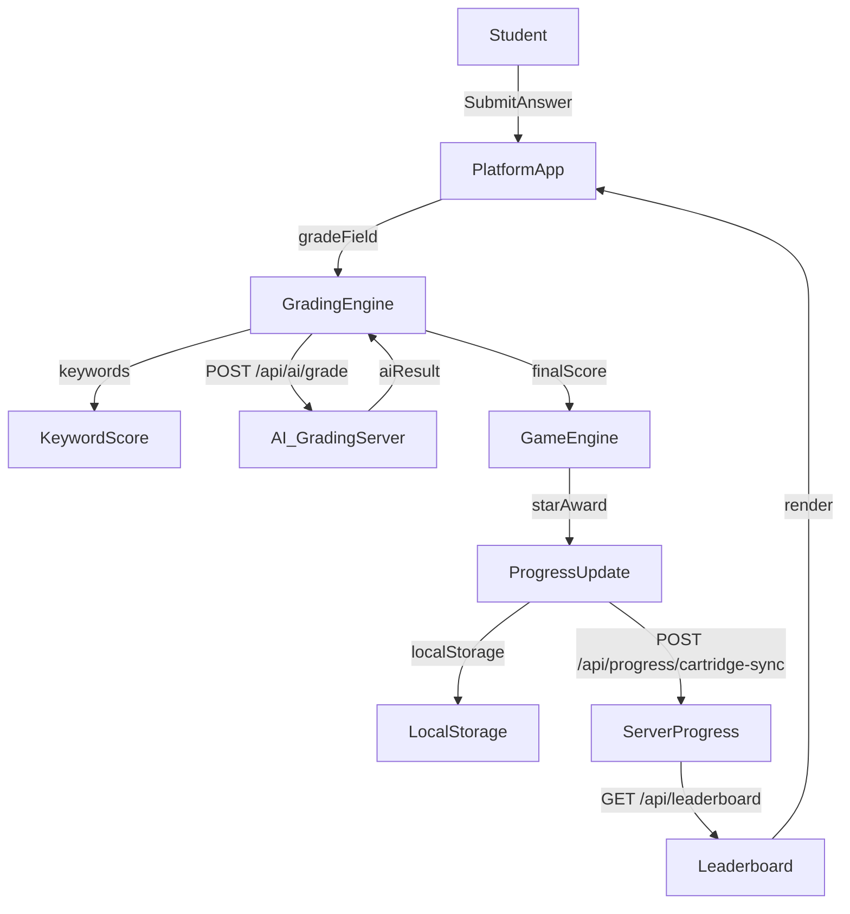
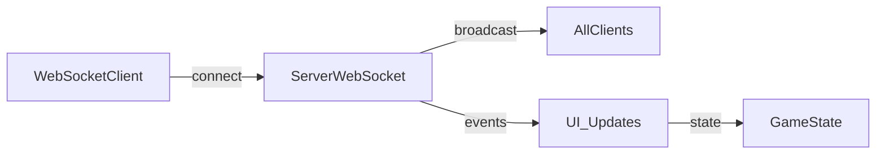

# State Machine Connections

This document makes explicit the connections between state machines, the runtime components that implement them, and the network/persistence boundaries. It is derived from `docs/STATE_MACHINES.md`, `cartridges/CARTRIDGE-STATE-MACHINE.md`, and the current repo structure.

## 1) Core Learning Loop Connections (Active)

**Cartridge Load → Problem Gen → Grading → Star Award → Progression**
- **Load**: `platform/app.html` → `platform/platform.js` → `platform/core/cartridge-loader.js`
  - State refs: `CARTRIDGE-STATE-MACHINE.md` §1.
- **Generate**: `platform/platform.js` → `generator.generateProblem()` + `shuffle-bag`
  - State refs: `CARTRIDGE-STATE-MACHINE.md` §2.
- **Render**: `platform/core/input-renderer.js` + `platform/core/graph-engine.js`
  - State refs: `STATE_MACHINES.md` §7.
- **Grade**: `platform/core/grading-engine.js`
  - State refs: `STATE_MACHINES.md` §2, §22; `CARTRIDGE-STATE-MACHINE.md` §3.
- **Star award**: `platform/core/game-engine.js`
  - State refs: `STATE_MACHINES.md` §§1,4,26.
- **Progression**: `platform/app.html` → `renderModeTabs()` + overrides
  - State refs: `STATE_MACHINES.md` §§5,101–107.

## 2) AI Feedback Panel Connections (Active)
- **onGradingComplete** in `platform/app.html` calls:
  - `updateAIFeedbackPanel()` for successful AI responses
  - `showAIFeedbackError()` on AI failures
  - `hideAIFeedbackPanel()` on Skip/Next/Try Again
- State refs: `STATE_MACHINES.md` §46; `CARTRIDGE-STATE-MACHINE.md` §8.

## 3) Progress Sync + Leaderboard Connections (Active)
- **Write**:
  - `POST /api/progress` (legacy data) in `railway-server/server.js`
  - `POST /api/progress/cartridge-sync` (newer aggregate sync)
- **Read**:
  - `GET /api/leaderboard` merges `lsrl_progress` + `user_progress`
  - State refs: `STATE_MACHINES.md` §11.
- **Boundary**:
  - Supabase tables: `lsrl_progress`, `user_progress` (migration 004).

## 4) Roster + Periodization Connections (Active)
- `platform/core/roster-modal.js` ⇄ `railway-server/server.js`
  - Endpoints: `GET/PUT /api/roster`, `POST /api/roster/bulk-assign`
  - State refs: `STATE_MACHINES.md` §109.

## 5) Progression Overrides Connections (Active)
- Client changes → `PUT /api/progression-overrides/:cartridgeId/:modeId`
- Server broadcasts `progression_override_changed` / `progression_override_removed`
- State refs: `STATE_MACHINES.md` §§101–105.

## 6) Ghost System Connections (Active)
- **Core training + sync**: `platform/core/ghost-engine.js` ⇄ `POST /api/ghost/:cartridgeId/sync`
  - State refs: `STATE_MACHINES.md` §§128–134.
- **Maze**: `ghost-maze-generator.js` + `ghost-maze-renderer.js`
  - State refs: §§131–132.
- **Battle**: `ghost-battle-engine.js` ⇄ `POST /api/ghost/:cartridgeId/battle/challenge`
  - State refs: §133.

## 7) Ghost Orbits Connections (Active)
- **Client**: `platform/game/ghost-orbits-controller.js` + `platform/core/ghost-orbits-*`
- **Server**: `railway-server/ghost-orbits-manager.js` (arena state)
- **State refs**: `STATE_MACHINES.md` §§135–142.

## 8) WebSocket Connections (Active)

**Current WebSocket usage (per docs):**
- Progression override broadcasts.
- Ghost battle completion.
- Real-time leaderboard updates (historical Grid Wars).

## 9) Historical Connections (Reference-Only)
`STATE_MACHINES.md` §§3–19 and 33–108 describe the removed Grid Wars and Pong Duel systems. Only treat as active if re-enabled.

